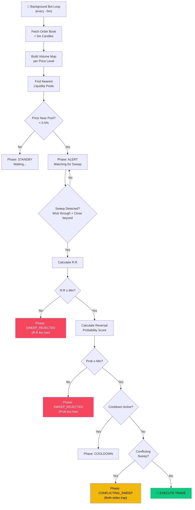
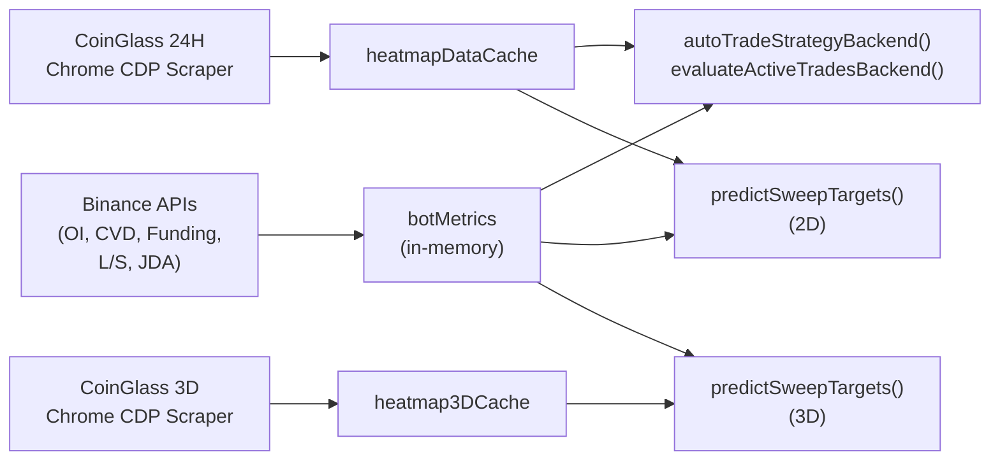

# 📊 Analisis Strategi Liquidity Sweep Reversal (LSR)

## Overview

Strategi LSR adalah **automated trading bot** yang memanfaatkan data **liquidation heatmap** (order book) dan **Binance market metrics** untuk mendeteksi saat harga menyapu (*sweep*) liquidity pool, kemudian melakukan entry reversal (pembalikan arah).

> [!NOTE]
> Strategi ini berjalan di server-side sebagai background worker 24/7, menganalisis data setiap siklus (~5 menit), dan secara otomatis membuka/menutup trade berdasarkan aturan yang dikonfigurasi.

---

## Arsitektur Pipeline Keputusan



---

## Detail Komponen

### 1. Data Sources

#### 🔥 Primary: CoinGlass Liquidation Heatmap (Scraper via Chrome CDP)

| Source | Data | Timeframe | Metode |
|--------|------|-----------|--------|
| **CoinGlass Heatmap 24H** | Liquidation pool levels + volume | 24 jam | `scrapeHeatMap()` — scrape React Fiber dari ECharts chart di `coinglass.com/pro/futures/LiquidationHeatMap` |
| **CoinGlass Heatmap 3D** | Liquidation pool levels + volume | 3 hari | `scrapeHeatMap3D()` — navigate ke halaman yang sama, klik dropdown "3D", scrape data |

> [!IMPORTANT]
> Data **CoinGlass Liquidation Heatmap** berbeda secara fundamental dari order book biasa:
> - Ini adalah **estimasi posisi leverage** yang akan di-liquidasi di harga tertentu
> - Pool yang besar = banyak trader dengan leverage tinggi yang SL/liquidation-nya ada di zone tersebut
> - Ini jauh lebih **stabil** daripada order book (yang bisa berubah setiap detik)
> - TF 3D memberikan panorama liquidation yang lebih lebar → lebih reliable untuk TP targeting

#### Secondary: Binance API (Market Metrics untuk Reversal Probability)

| Source | Data | Interval |
|--------|------|----------|
| **Binance OI History** | Open Interest change | 5m (13 bars ≈ 1 jam) |
| **Binance Spot Klines** | CVD (Cumulative Volume Delta) | 5m (12 bars) |
| **Binance Funding Rate** | Premium Index | Real-time |
| **Binance L/S Ratio** | Global Long/Short Account | 5m |
| **JDA Signal Engine** | VZO + ZLEMA multi-timeframe trend (15m, 1h, 4h, 1d, 1w) | Per cycle |
| **Binance 15m Klines** | Konfirmasi tambahan | 20 bars |

#### Data Flow dalam Bot Cycle (setiap 3 menit):



### 2. Sweep Detection Logic

```
Sweep = Wick menembus liquidity pool + Close kembali di sisi reversal
```

- **LONG setup**: Candle wick turun menembus pool SUPPORT, tapi close di ATAS pool → sinyal reversal naik
- **SHORT setup**: Candle wick naik menembus pool RESISTANCE, tapi close di BAWAH pool → sinyal reversal turun

#### Scoring Formula per Sweep Candidate:
```
score = volume × (1 + rejectionStrength) × (1 + wickDepth) × (1 + confirmCount × 0.2)
```

### 3. Reversal Probability Model (100-point scoring)

| # | Faktor | Max Poin | Logika |
|---|--------|----------|--------|
| Base | Starting score | 40 | Semua mulai dari 40% |
| 1 | **Pool Volume** | +15 | `min(15, volBillions × 15)` — pool $1B = max |
| 2 | **Rejection Strength** (wick depth) | +15 | `min(15, rejStrength × 15)` |
| 3 | **OI Change** | ±10 | OI turun = +poin (long squeeze selesai), OI naik = -poin |
| 4 | **Spot CVD Divergence** | +10 | CVD searah trade = full 10 poin |
| 5 | **HTF Trend (1h + 4h)** | +10 | EMA50 alignment: +5 per timeframe |
| 6 | **Funding Rate** | ±10 | Funding berlawanan trade = +poin (crowded trade unwind) |
| 7 | **Long/Short Ratio** | ±10 | Ratio rendah saat LONG = +poin (kontrarian) |
| | **Total Range** | **10–99%** | Di-clamp antara 10% dan 99% |

### 4. Trade Execution & Sizing

```
SL = Sweep candle extreme ± ATR(14) × multiplier
     (minimum floor: 0.5% dari entry)

TP = Pool terbesar di sisi opposing yang belum tersapu
     (fallback: 2× SL distance)

R:R = TP distance / SL distance

Position Size = (Capital × Risk%) / SL%
```

### 5. Exit Management (3 Cara Keluar)

| Exit Type | Kondisi | Contoh |
|-----------|---------|--------|
| **HIT_TP** ✅ | Harga menyentuh Take Profit | Wick High ≥ TP (LONG) |
| **HIT_SL** 🚨 | Harga menyentuh Stop Loss | Wick Low ≤ SL (LONG) |
| **CUT_LOSS** ⚠️ | Pool TP menyusut > 50% | Volume pool target turun dari initial — liquidity sudah habis |

> [!IMPORTANT]
> **Auto-Cut (Pool -50%)** adalah fitur unik strategi ini. Jika liquidity pool target (TP) sudah "dimakan" pasar (volume turun 50%), bot otomatis menutup posisi karena alasan entry sudah tidak valid — magnet harga tidak ada lagi.

### 6. Safety Filters

| Filter | Fungsi |
|--------|--------|
| **Max Active Trades** | Membatasi jumlah posisi terbuka |
| **Cooldown Timer** | Mencegah re-entry pada zone yang sama dalam X menit |
| **Conflicting Sweep** | Mendeteksi "both-sides trap" — sweep di kedua sisi = skip |
| **Min R:R** | Entry ditolak jika Risk:Reward di bawah threshold |
| **Min Reversal Prob** | Entry ditolak jika probability score terlalu rendah |
| **Stale Sweep Check** | Sweep oleh candle lama diabaikan (hanya candle recent yang dihitung) |

---

## 📈 Analisis Performa (dari Screenshot)

### Statistik Keseluruhan

| Metrik | Nilai | Assessment |
|--------|-------|------------|
| Total Trades | **3** | Sample sangat kecil |
| Win Rate | **0.0%** | ❌ Belum ada trade yang profit |
| Hit TP | **0** | Belum ada target tercapai |
| Hit SL | **1** | 1 trade kena stop loss |
| Cut Loss (Pool -50%) | **2** | 2 trade di-auto-cut |
| Net PnL (USD) | **-$13.62** | Rugi kecil |
| Net PnL (Bs.) | **-Bs. 94.82** | |

### Detail Per-Trade

| # | Time | Dir | Entry | TP | SL | Size | R:R | Result | PnL |
|---|------|-----|-------|----|----|------|-----|--------|-----|
| 1 | 22 Jun 04:16 | **SHORT** | $63,612 | $62,957 | $63,874 | $2,435 | 1:2.51 | 🚨 HIT SL | -$10.00 |
| 2 | 23 Jun 05:37 | **SHORT** | $63,979 | $63,115 | $64,419 | $1,454 | 1:1.96 | ⚠️ CUT LOSS | +$0.56 |
| 3 | 23 Jun 23:13 | **LONG** | $62,727 | $65,364 | $62,360 | $1,709 | 1:7.18 | ⚠️ CUT LOSS | -$4.19 |

### Observasi Kritis

> [!WARNING]
> **Masalah Utama yang Teridentifikasi:**

#### 1. **Auto-Cut (Pool -50%) terlalu sering trigger** — 2 dari 3 trade
Ini menunjukkan bahwa:
- Liquidity pool di CoinGlass **berubah saat posisi leverage ditutup/diliquidasi** — ini natural behavior, bukan noise
- Saat harga mendekati pool, trader bisa menutup posisi mereka sebelum ter-liquidasi → pool menyusut
- Namun shrinkage 50% **mungkin terlalu sensitif** — pool CoinGlass 24H bisa berfluktuasi 20-40% secara normal antar refresh
- Data 3D seharusnya lebih stabil karena span lebih lebar, tapi **saat ini 3D hanya digunakan untuk `predictSweepTargets()`, BUKAN untuk auto-cut detection**

#### 2. **Win Rate 0%** 
- Trade #1 (SHORT) kena SL karena harga naik ke $63,927 menembus SL $63,874
- Trade #2 dan #3 di-cut sebelum sempat profit/loss signifikan

#### 3. **R:R yang bagus (1:7.18) sia-sia** 
- Trade #3 LONG punya R:R 1:7.18 yang excellent, tapi di-cut di -$4.19 karena pool shrinkage

#### 4. **Bias SHORT** — 2 dari 3 trade SHORT di market yang sideways/bullish
- Current phase: ALERT, nearest pool RESISTANCE di $62,741
- L/S Ratio: 2.09 (very long-heavy) → bot mungkin terlalu agresif mencari SHORT setup

---

## 🔧 Rekomendasi Perbaikan

### Prioritas Tinggi

| # | Masalah | Solusi | Impact |
|---|---------|--------|--------|
| 1 | Pool shrinkage too sensitive | Naikkan threshold dari 50% ke **70%**, atau gunakan **rata-rata volume dari 3 cycle terakhir** sebagai baseline (bukan single snapshot) | Mengurangi premature exit |
| 2 | Hanya pakai 24H untuk auto-cut | **Gunakan data 3D (`heatmap3DCache`)** untuk validasi pool shrinkage — pool yang masih besar di 3D tapi menyusut di 24H artinya pool masih valid (trader baru masuk di TF lebih pendek) | Mengurangi false CUT_LOSS |
| 3 | Tidak ada trailing stop | Implementasi **trailing SL** yang bergerak ke breakeven setelah +0.3% profit | Melindungi profit |

### Prioritas Sedang

| # | Area | Rekomendasi |
|---|------|-------------|
| 4 | **Min R:R** saat ini 2 | Pertimbangkan menaikkan ke **2.5 atau 3** — trade #2 dengan R:R 1.96 mestinya sudah di-filter |
| 5 | **Reversal Probability** | Min prob saat ini 50% — pertimbangkan menaikkan ke **60%** untuk entry yang lebih selektif |
| 6 | **Cooldown** | 60 menit mungkin kurang — setelah CUT_LOSS, tambahkan cooldown extra |
| 7 | **HTF Trend Filter** | Hindari SHORT saat 1h DAN 4h BULLISH (double penalty sudah ada, tapi mungkin perlu hard-block) |

### Prioritas Rendah (Optimasi Lanjutan)

| # | Ide |
|---|-----|
| 8 | Tambahkan **volume profile** (VPVR) dari exchange sebagai konfirmasi tambahan |
| 9 | Gunakan **multi-timeframe heatmap** (3D data yang sudah tersedia) untuk konfirmasi sweep |
| 10 | Implementasi **partial TP** — close 50% posisi di R:R 1:1, sisanya trailing |
| 11 | Tambahkan **max daily loss** circuit breaker untuk menghentikan bot setelah X% loss per hari |

---

## Kesimpulan

Konsep strategi LSR secara teori **solid** — memanfaatkan liquidity sweep + multi-factor confirmation adalah pendekatan institusional yang valid. Namun implementasi saat ini menghadapi tantangan utama:

1. **Order book data bersifat ephemeral** — pool yang terlihat besar bisa hilang dalam hitungan detik, menyebabkan auto-cut prematur
2. **Sample size masih terlalu kecil** (3 trade) untuk menarik kesimpulan statistik
3. **Perlu optimasi parameter** terutama di area pool shrinkage threshold dan trailing stop

> [!TIP]
> **Langkah selanjutnya yang disarankan:**
> 1. Jalankan bot selama 1-2 minggu lagi untuk mengumpulkan data minimal 20-30 trade
> 2. Naikkan pool shrinkage threshold ke 70% sebagai quick fix
> 3. Implementasi trailing stop untuk melindungi profit pada trade yang sudah bergerak sesuai arah
