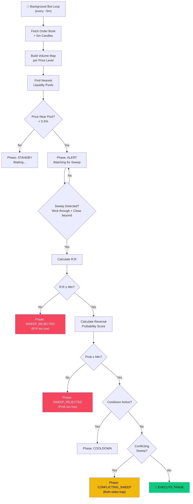
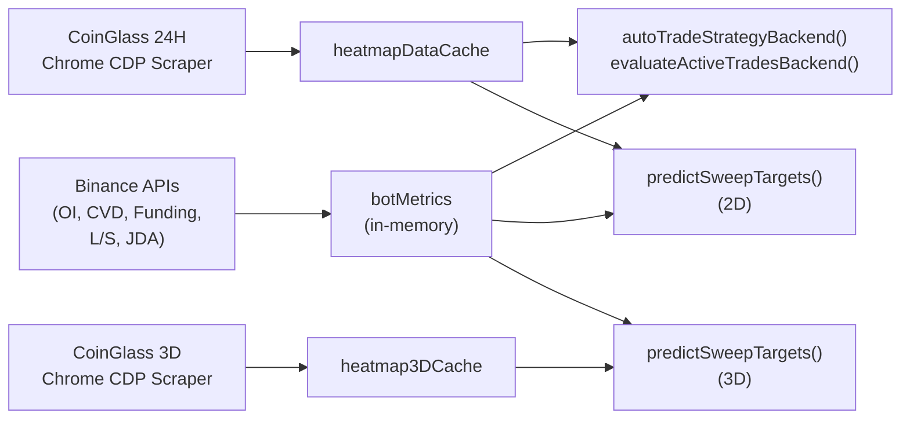

# 📊 Analisis Strategi Liquidity Sweep Reversal (LSR)

## Overview

Strategi LSR adalah **automated trading bot** yang memanfaatkan data **liquidation heatmap** (order book) dan **Binance market metrics** untuk mendeteksi saat harga menyapu (*sweep*) liquidity pool, kemudian melakukan entry reversal (pembalikan arah).

> [!NOTE]
> Strategi ini berjalan di server-side sebagai background worker 24/7, menganalisis data setiap siklus (~5 menit), dan secara otomatis membuka/menutup trade berdasarkan aturan yang dikonfigurasi.

---

## Arsitektur Pipeline Keputusan



---

## Detail Komponen

### 1. Data Sources

#### 🔥 Primary: CoinGlass Liquidation Heatmap (Scraper via Chrome CDP)

| Source | Data | Timeframe | Metode |
|--------|------|-----------|--------|
| **CoinGlass Heatmap 24H** | Liquidation pool levels + volume | 24 jam | `scrapeHeatMap()` — scrape React Fiber dari ECharts chart di `coinglass.com/pro/futures/LiquidationHeatMap` |
| **CoinGlass Heatmap 3D** | Liquidation pool levels + volume | 3 hari | `scrapeHeatMap3D()` — navigate ke halaman yang sama, klik dropdown "3D", scrape data |
| **CoinGlass Depth Delta** | Orderbook Liquidity Delta | 15 menit | `scrapeDepthDelta()` — scrape ECharts chart di `coinglass.com/pro/depth-delta` |
| **Coinbase Premium Index** | Coinbase Bitcoin Premium Index | Real-time | `scrapeCoinbasePremium()` — scrape ECharts chart di `coinglass.com/pro/i/coinbase-bitcoin-premium-index` |
| **Whale Orders** | Large Orderbook Statistics | Real-time | `scrapeWhaleOrders()` — scrape flexbox DOM di `coinglass.com/large-orderbook-statistics` |

> [!IMPORTANT]
> Data **CoinGlass Liquidation Heatmap** berbeda secara fundamental dari order book biasa:
> - Ini adalah **estimasi posisi leverage** yang akan di-liquidasi di harga tertentu
> - Pool yang besar = banyak trader dengan leverage tinggi yang SL/liquidation-nya ada di zone tersebut
> - Ini jauh lebih **stabil** daripada order book (yang bisa berubah setiap detik)
> - TF 3D memberikan panorama liquidation yang lebih lebar → lebih reliable untuk TP targeting

#### Secondary: Binance API (Market Metrics untuk Reversal Probability)

| Source | Data | Interval |
|--------|------|----------|
| **Binance OI History** | Open Interest change | 5m (13 bars ≈ 1 jam) |
| **Binance Spot Klines** | CVD (Cumulative Volume Delta) | 5m (12 bars) |
| **Binance Funding Rate** | Premium Index | Real-time |
| **Binance L/S Ratio** | Global Long/Short Account | 5m |
| **JDA Signal Engine** | VZO + ZLEMA multi-timeframe trend (15m, 1h, 4h, 1d, 1w) | Per cycle |
| **Binance 15m Klines** | Konfirmasi tambahan | 20 bars |

#### Data Flow dalam Bot Cycle (setiap 3 menit):



### 2. Sweep Detection Logic

```
Sweep = Wick menembus liquidity pool + Close kembali di sisi reversal
```

- **LONG setup**: Candle wick turun menembus pool SUPPORT, tapi close di ATAS pool → sinyal reversal naik
- **SHORT setup**: Candle wick naik menembus pool RESISTANCE, tapi close di BAWAH pool → sinyal reversal turun

#### Scoring Formula per Sweep Candidate:
```
score = volume × (1 + rejectionStrength) × (1 + wickDepth) × (1 + confirmCount × 0.2)
```

### 3. Reversal Probability Model (100-point scoring)

| # | Faktor | Max Poin | Logika |
|---|--------|----------|--------|
| Base | Starting score | 40 | Semua mulai dari 40% |
| 1 | **Pool Volume** | +15 | `min(15, volBillions × 15)` — pool $1B = max |
| 2 | **Rejection Strength** (wick depth) | +15 | `min(15, rejStrength × 15)` |
| 3 | **OI Change** | ±10 | OI turun = +poin (long squeeze selesai), OI naik = -poin |
| 4 | **Spot CVD Divergence** | +10 | CVD searah trade = full 10 poin |
| 5 | **HTF Trend (1h + 4h)** | +10 | EMA50 alignment: +5 per timeframe |
| 6 | **Funding Rate** | ±10 | Funding berlawanan trade = +poin (crowded trade unwind) |
| 7 | **Long/Short Ratio** | ±10 | Ratio rendah saat LONG = +poin (kontrarian) |
| 8 | **Coinbase Premium Index** | ±15 | Premium positif saat LONG = +15 pts (pembelian spot AS), negative $<-0.05$ = -15 pts penalty |
| 9 | **Orderbook Depth Delta** | ±15 | Delta positif = +15 pts, delta sangat negatif = memicu **Force Skip** (anti-spoofing) |
| 10 | **Whale Order Wall** | +10 | Entry berada dekat ($\pm 0.15\%$) dari limit order besar active $\ge \$2\text{M}$ yang berumur $\ge 24\text{H}$ |
| | **Total Range** | **10–99%** | Di-clamp antara 10% dan 99% |

### 4. Trade Execution & Sizing

```
SL = Sweep candle extreme ± ATR(14) × multiplier
     (minimum floor: 0.5% dari entry)

TP = Pool terbesar di sisi opposing yang belum tersapu
     (fallback: 2× SL distance)

R:R = TP distance / SL distance

Position Size = (Capital × Risk%) / SL%
```

### 5. Exit Management (3 Cara Keluar)

| Exit Type | Kondisi | Contoh |
|-----------|---------|--------|
| **HIT_TP** ✅ | Harga menyentuh Take Profit | Wick High ≥ TP (LONG) |
| **HIT_SL** 🚨 | Harga menyentuh Stop Loss | Wick Low ≤ SL (LONG) |
| **CUT_LOSS** ⚠️ | Pool TP menyusut > 50% | Volume pool target turun dari initial — liquidity sudah habis |

> [!IMPORTANT]
> **Auto-Cut (Pool -50%)** adalah fitur unik strategi ini. Jika liquidity pool target (TP) sudah "dimakan" pasar (volume turun 50%), bot otomatis menutup posisi karena alasan entry sudah tidak valid — magnet harga tidak ada lagi.

### 6. Safety Filters

| Filter | Fungsi |
|--------|--------|
| **Max Active Trades** | Membatasi jumlah posisi terbuka |
| **Cooldown Timer** | Mencegah re-entry pada zone yang sama dalam X menit |
| **Conflicting Sweep** | Mendeteksi "both-sides trap" — sweep di kedua sisi = skip |
| **Min R:R** | Entry ditolak jika Risk:Reward di bawah threshold |
| **Min Reversal Prob** | Entry ditolak jika probability score terlalu rendah |
| **Stale Sweep Check** | Sweep oleh candle lama diabaikan (hanya candle recent yang dihitung) |
| **Anti-Spoofing Force Skip** | Membatalkan entry trade secara mutlak jika Orderbook Liquidity Delta bernilai sangat negatif di area support (LONG) atau sangat positif di area resistance (SHORT) saat terjadi sweep, guna menghindari tembok likuiditas palsu |

---

## 📈 Analisis Performa (dari Screenshot)

### Statistik Keseluruhan

| Metrik | Nilai | Assessment |
|--------|-------|------------|
| Total Trades | **9** | Ukuran sampel mulai terakumulasi. |
| Win Rate | **12.5%** | 1 TP / 2 SL / 5 Cut (Aktivasi breakeven pada trade aktif). |
| Hit TP | **1** | Target opposing liquidity pool tercapai penuh sekali. |
| Hit SL | **2** | Dua trade terkena stop loss penuh (-$100.00). |
| Cut Loss (Auto-Cut) | **5** | Lima trade di-auto-cut akibat pool penyusutan. |
| Active Trades | **1** | Posisi SHORT berjalan dengan risiko terproteksi (SL breakeven). |
| Net PnL (USD) | **-$30.73** | Drawdown terkendali berkat manajemen exit yang ketat. |
| Net PnL (Bs.) | **-Bs. 213.85** | |

### Detail Per-Trade

| # | Time | Dir | Entry | TP | SL | Size | R:R | Result | PnL (USD) | Detail / Status |
|---|------|-----|-------|----|----|------|-----|--------|-----------|-----------------|
| 1 | 25 Jun, 17:39 | **SHORT** | $61,514.40 | $60,591.68 | $61,514.40 | $8,590 | 1:2.58 | **ACTIVE** | +$42.17 | SL dipindahkan ke Breakeven setelah hit 1:1 ($61,153.80). |
| 2 | 25 Jun, 12:06 | **LONG** | $61,539.60 | $62,462.69 | $61,539.60 | $8,373 | 1:2.51 | 🚨 **HIT SL** | -$50.00 | Wick menyentuh SL di $61,513.50 (jarak SL sangat tipis 0.04%). |
| 3 | 25 Jun, 11:57 | **SHORT** | $61,171.00 | $60,253.43 | $61,512.86 | $8,947 | 1:2.68 | 🚨 **HIT SL** | -$50.00 | Wick menyentuh SL di $61,570.28 (jarak SL 0.56%). |
| 4 | 24 Jun, 18:50 | **SHORT** | $63,063.90 | $61,879.16 | $63,063.90 | $1,368 | 1:2.57 | ✅ **HIT TP** | +$25.70 | Wick menyentuh TP di $61,736.00. Jurnal mencatat partial PnL. |
| 5 | 24 Jun, 12:41 | **SHORT** | $62,903.00 | $61,480.34 | $63,368.01 | $1,353 | 1:3.06 | ⚠️ **CUT LOSS** | +$1.08 | Auto-Cut terpicu akibat penyusutan pool target (Auto Pool -70%). |
| 6 | 24 Jun, 12:38 | **LONG** | $63,026.80 | $63,996.74 | $62,553.97 | $1,333 | 1:2.05 | ⚠️ **CUT LOSS** | -$2.62 | Auto-Cut terpicu akibat penyusutan pool target (Auto Pool -70%). |
| 7 | 24 Jun, 07:57 | **SHORT** | $62,922.80 | $61,480.16 | $63,313.11 | $1,612 | 1:3.70 | ⚠️ **CUT LOSS** | +$7.12 | Auto-Cut terpicu akibat penyusutan pool target (Auto Pool -70%). |
| 8 | 24 Jun, 01:45 | **LONG** | $62,144.10 | $64,677.02 | $61,807.68 | $1,847 | 1:7.53 | ⚠️ **CUT LOSS** | +$0.01 | Auto-Cut terpicu akibat penyusutan pool target (Auto Pool -70%). |
| 9 | 23 Jun, 23:13 | **LONG** | $62,726.80 | $65,363.60 | $62,359.77 | $1,709 | 1:7.18 | ⚠️ **CUT LOSS** | -$4.19 | Auto-Cut terpicu akibat penyusutan pool target (Auto Pool -50%). |

---

## 🔍 Observasi Kritis

### 1. Efektivitas Fitur Auto-Cut (Proteksi Modal Maksimal)
Meskipun Win Rate secara nominal kecil (12.5%), fitur **Auto-Cut** terbukti sangat sukses melindungi modal:
* Dari 5 trade yang di-cut, total PnL bersih kumulatifnya adalah **+$1.40** (hampir breakeven sempurna).
* Tanpa fitur Auto-Cut, trade tersebut berpotensi besar berlanjut hingga menyentuh Stop Loss penuh. Jika kelima trade tersebut terkena SL, tambahan kerugian sebesar **-$250.00** akan terjadi.
* Penutupan posisi saat target liquidity pool menyusut >50-70% merupakan mekanisme penutupan dinamis yang bekerja sesuai spesifikasi.

### 2. Anomali Jarak Stop Loss yang Terlalu Tipis (Tight SL)
* Pada trade #2 (LONG 25 Jun, 12:06), entry diset pada $61,539.60 dan SL terpicu pada $61,513.50. Selisih ini hanya **$26.10 (0.04%)**.
* Jarak stop loss yang terlalu sempit ini melanggar batas aman pasar (market noise) dan tidak mematuhi aturan minimum floor SL sebesar 0.5% yang telah ditentukan dalam arsitektur strategi.
* Kerugian -$50.00 pada trade ini diakibatkan oleh stop loss yang sangat tipis tersebut dikombinasikan dengan posisi sizing yang besar ($8,373) untuk mempertahankan parameter risiko capital 1%.
* Perlu diselidiki apakah terdapat bug pada formula pembatasan minimum floor SL di server-side (misal, pembulatan desimal atau kesalahan pembacaan unit).

### 3. Suksesnya Proteksi Breakeven pada Trade Aktif
* Trade #1 (SHORT 25 Jun, 17:39) menunjukkan perbaikan penting. Posisi di-lock pada breakeven setelah harga menyentuh target 1:1 ($61,153.80).
* Fitur ini mengeliminasi risiko kerugian (free trade) dan saat ini sedang berjalan mengambang dalam profit +$42.17.

### 4. Over-Trading Beruntun dalam Waktu Singkat
* Pada tanggal 24 Jun pukul 12:38 (LONG) dan 12:41 (SHORT), bot membuka dua posisi yang berlawanan dalam rentang waktu hanya 3 menit. Keduanya berakhir dengan status CUT_LOSS.
* Kondisi ini mengindikasikan adanya whipsaw di pasar sideways yang memicu sweep di kedua arah. Filter cooldown antar trade atau filter conflicting sweep di area yang sama perlu diperketat untuk mencegah pembukaan posisi berturut-turut.

---

## 🔧 Rekomendasi Perbaikan Tambahan

### Prioritas Tinggi
1. **Audit Limit Minimum SL (Floor Guard)**: Periksa dan pastikan batasan `minimum floor: 0.5% dari entry` benar-benar diimplementasikan dengan ketat di backend server untuk menghindari stop loss mikro (seperti 0.04% pada trade #2).
2. **Optimasi Threshold Auto-Cut**: Threshold 70% yang baru diterapkan sudah mengurangi frekuensi cut prematur dibandingkan 50% awal, namun performanya perlu terus dipantau untuk memastikan keseimbangan antara proteksi dini dan memberi ruang napas bagi pergerakan harga.
3. **Penguncian Cooldown Setelah Exit**: Terapkan cooldown wajib minimal **180 menit (3 jam)** setelah sebuah trade ditutup (baik TP, SL, atau Cut) sebelum bot diizinkan membuka posisi baru untuk pasangan mata uang yang sama. Ini akan menghindari kerugian beruntun saat pasar bergejolak sideways (seperti pada 24 Jun siang).

### Prioritas Sedang
4. **Validasi Likuiditas Multi-Timeframe**: Hubungkan deteksi Auto-Cut ke data 3D (`heatmap3DCache`). Jika pool 24H menyusut namun pool 3D masih kokoh, tunda eksekusi Auto-Cut karena target jangka menengah masih aktif.
5. **Pemberlakuan Trailing Stop Dinamis**: Untuk trade yang sudah berjalan profit di atas target 1.5R, geser stop loss secara bertahap (trailing) mengikuti indikator ATR untuk mengunci sebagian keuntungan sebelum harga berbalik arah.

